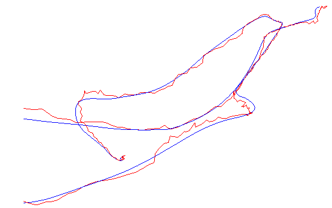

# 实验手册

## 实验内容
- 如何使用Sophus李群李代数基础
- 基于李代数参数空间的error估计，以及轨迹可视化

## 具体实验过程
- 编译方法：
```
mkdir build & cd build
cmake ..
make
```

- 李群李代数库sophus的基本使用
```
#程序逻辑
#主要有三维特殊正交群的对数映射，实现三维旋转矩阵到旋转向量的转换
#三维旋转向量到反对称，以及反对称到三维向量的相互转换
./useSophus
```

- 基于李代数参数空间的error估计，以及轨迹可视化
```
# 程序逻辑：读取位姿的估计值和真值，格式为时间，描述旋转的四元数，位移，并转换为欧式变换
# 并将欧式变换的误差根据李群李代数的对数映射规则，映射到李代数的参数空间计算RMSE
# 将translation作为坐标点绘制轨迹的可视化
cd example
./trajectoryError
```

轨迹误差效果图如下：

