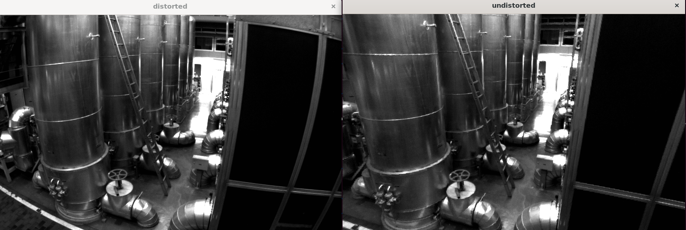
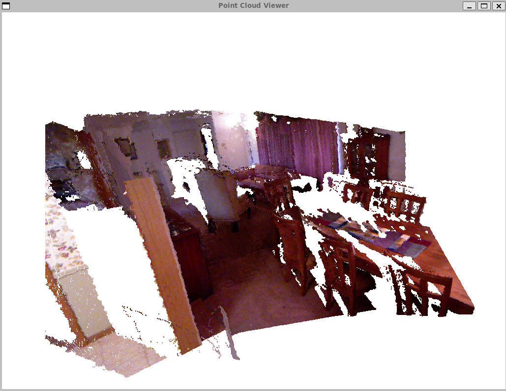
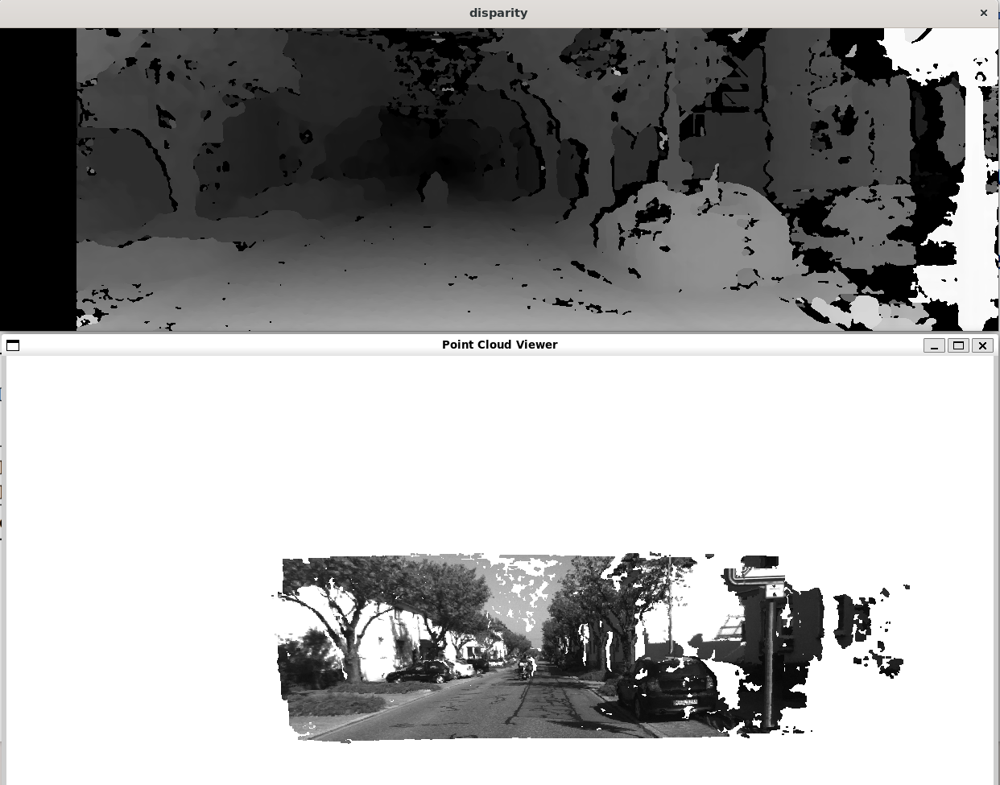

# 实验手册
- 编译方法
```
mkdir build && cd build
cmake ..
make
```

## 图像去畸变
运行去畸变程序方法
```
#./build/imageBasics路径
cd imageBasics
./undistortImage
```

- 去畸变效果图如下




## 场景点云可视化
场景中多张rgb图片和对应的深度信息，以及图片的位姿变换信息相结合，生成场景点云信息并可视化（每个点云点绘制颜色信息）  
- 场景点云图效果图如下



## 双目视觉
基于双目两张图像，估计出视差图和点云图，效果如下：

