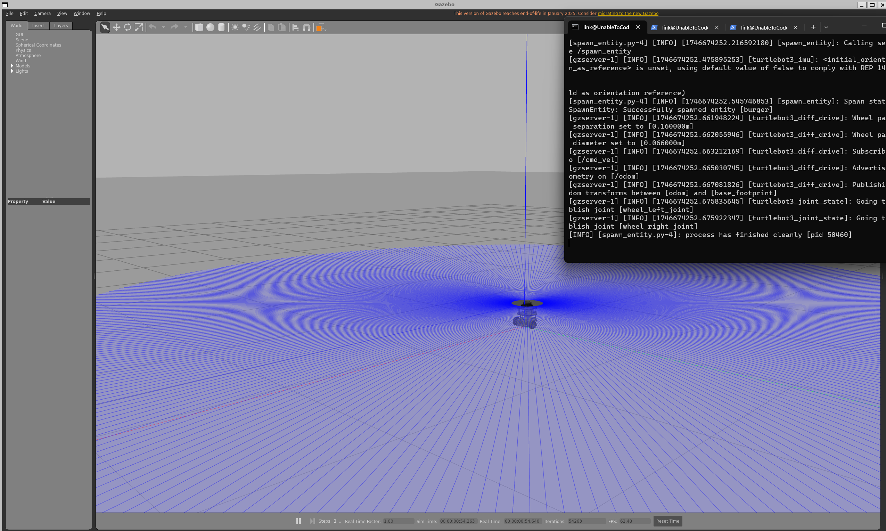
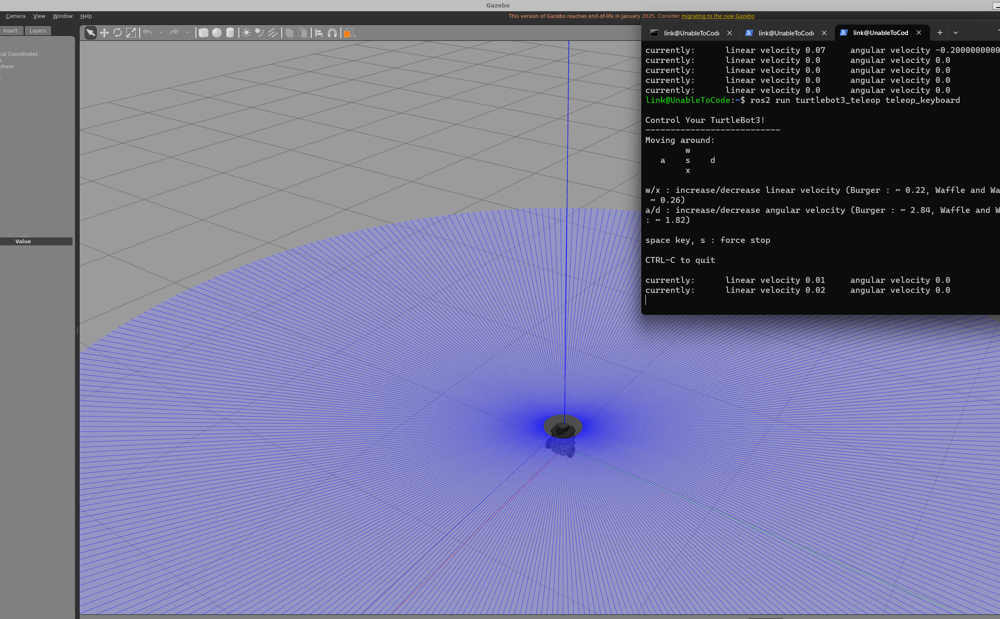
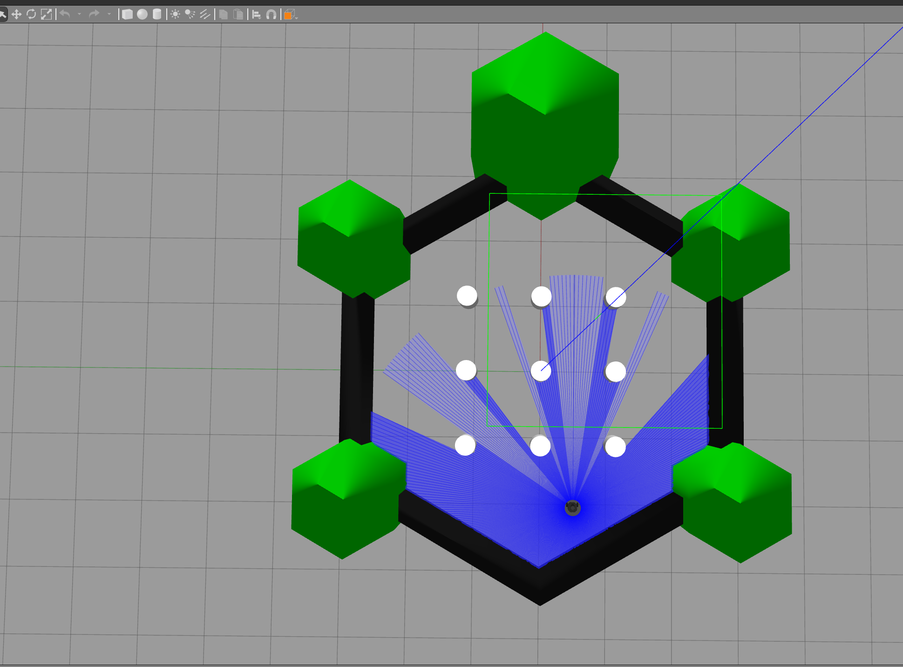
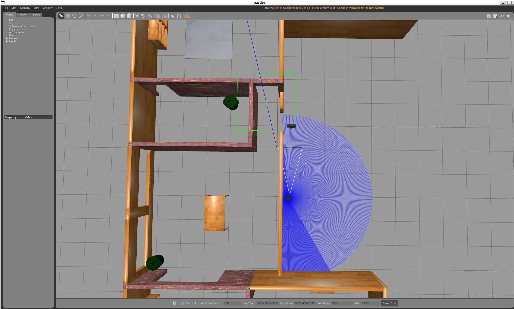
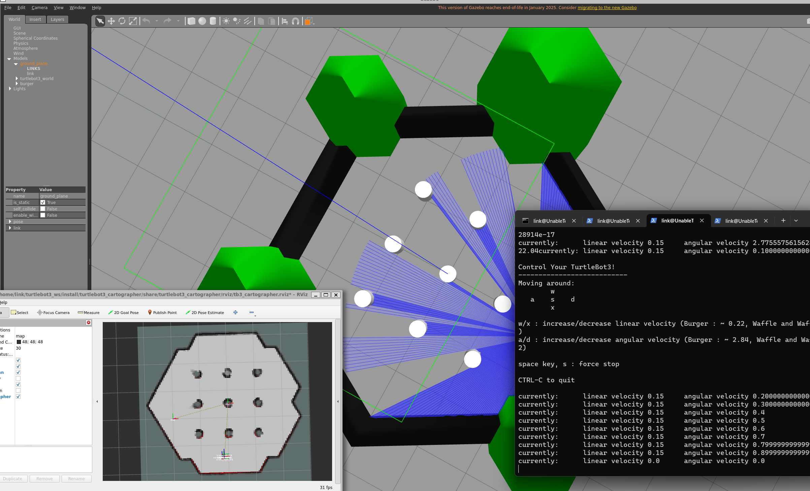

# TurtleBot3 Gazebo 仿真环境配置指南

参考链接： https://emanual.robotis.com/docs/en/platform/turtlebot3/simulation/


## 基本使用

在工作空间的 `src` 目录下克隆仿真包，并编译：

```bash
source /opt/ros/humble/setup.bash
cd ~/turtlebot3_ws/src/
git clone -b humble https://github.com/ROBOTIS-GIT/turtlebot3_simulations.git
git clone -b humble https://github.com/ROBOTIS-GIT/DynamixelSDK.git
git clone -b humble https://github.com/ROBOTIS-GIT/turtlebot3_msgs.git
git clone -b humble https://github.com/ROBOTIS-GIT/turtlebot3.git
sudo apt install python3-colcon-common-extensions
cd ~/turtlebot3_ws
colcon build --symlink-install
```

代码根目录结构：
```
├── DynamixelSDK
├── turtlebot3
├── turtlebot3_msgs
└── turtlebot3_simulations
```

### 安装 Cartographer（建图工具）
```bash
sudo apt install ros-humble-cartographer
sudo apt install ros-humble-cartographer-ros
```s
### 安装Navigation2
```bash
echo "Install Navigation2"
sudo apt install ros-humble-navigation2
sudo apt install ros-humble-nav2-bringup
```

- `turtlebot3_simulations/turtlebot3_gazebo/models/` 
  存放各种仿真模型（如turtlebot3_dqn_world、turtlebot3_world、autorace相关交通标志等），每个模型文件夹下通常有 model.config （模型元数据）和 model.sdf （模型结构定义）。
- `turtlebot3_simulations/turtlebot3_gazebo/worlds/ `：存放Gazebo仿真世界文件（.world），定义仿真环境的整体布局。
- `turtlebot3_simulations/turtlebot3_gazebo/launch/ `：包含仿真启动文件（.launch.py），用于一键启动仿真环境。
- `turtlebot3_simulations/turtlebot3_gazebo/rviz/ `：存放RViz可视化配置文件（如tb3_gazebo.rviz），用于仿真时的可视化展示。
- `turtlebot3_simulations/turtlebot3_fake_node/` ：提供虚拟节点，便于仿真时不依赖真实硬件。
- `turtlebot3_simulations/turtlebot3_simulations/package.xml & CMakeLists.txt `

定义整个仿真包的依赖和构建方式。

我们可以:
- 通过launch文件启动Gazebo仿真环境。
- 加载对应的world和robot模型。
- 可选地结合RViz进行可视化。

### 启动模拟世界

#### empty world

```bash
# echo 'source /usr/share/gazebo/setup.sh' >> ~/.bashrc
export TURTLEBOT3_MODEL=burger
ros2 launch turtlebot3_gazebo empty_world.launch.py
```
如下


如果启动出错，可查看[出错排他文档](./turtlebot3错误及解决合集.md)

我们可以通过键盘控制机器人的移动,另外开启一个终端，输入如下命令

```bash
# echo 'source ~/turtlebot3_ws/install/setup.bash' >> ~/.bashrc
# source ~/.bashrc
export TURTLEBOT3_MODEL=burger
ros2 run turtlebot3_teleop teleop_keyboard
```
- 使用wsad 控制机器人移动即可




#### TurtleBot3 World

```bash
export TURTLEBOT3_MODEL=waffle
ros2 launch turtlebot3_gazebo turtlebot3_world.launch.py
```



同上,仍然可以使用键盘控制机器人的移动。

#### TurtleBot3 House

```bash
export TURTLEBOT3_MODEL=waffle
ros2 launch turtlebot3_gazebo turtlebot3_house.launch.py
```



## 运行SLAM模拟

TurtleBot3 提供了三种 Gazebo 环境，推荐在进行 SLAM 建图时使用 **TurtleBot3 World** 或 **TurtleBot3 House**。  
本教程以 TurtleBot3 World 为例。请根据你的机器人型号（`burger`、`waffle`、`waffle_pi`）设置环境变量：

```bash
export TURTLEBOT3_MODEL=burger
ros2 launch turtlebot3_gazebo turtlebot3_world.launch.py
```
### 2. 启动 SLAM 节点
在新终端中运行以下命令，默认使用 Cartographer SLAM 方法：

```bash
export TURTLEBOT3_MODEL=burger
ros2 launch turtlebot3_cartographer cartographer.launch.py use_sim_time:=True
```

### 3. 启动遥控节点
再次打开新终端，运行遥控节点以控制机器人移动

```bash
export TURTLEBOT3_MODEL=burger
ros2 run turtlebot3_teleop teleop_keyboard
```

- 整体如下图

