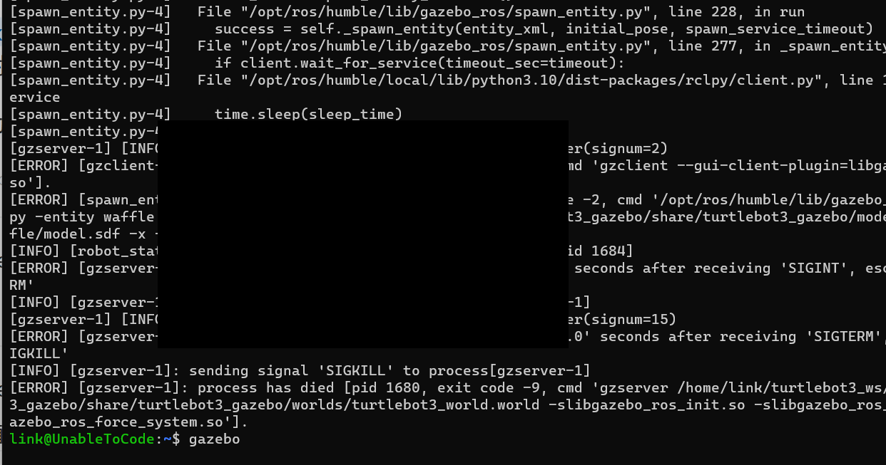

# turtlebot3错误及解决合集

- 大部分错误都是由于gazebo问题引起的。

## 编译

- 报错信息

```bash
[Processing: turtlebot3_gazebo]
--- stderr: turtlebot3_gazebo
CMake Warning (dev) at /usr/share/cmake-3.22/Modules/FindPackageHandleStandardArgs.cmake:438 (message):
  The package name passed to `find_package_handle_standard_args` (PkgConfig)
  does not match the name of the calling package (gazebo).  This can lead to
  problems in calling code that expects `find_package` result variables
  (e.g., `_FOUND`) to follow a certain pattern.
Call Stack (most recent call first):
  /usr/share/cmake-3.22/Modules/FindPkgConfig.cmake:99 (find_package_handle_standard_args)
  /usr/lib/x86_64-linux-gnu/cmake/gazebo/gazebo-config.cmake:72 (include)
  CMakeLists.txt:23 (find_package)
This warning is for project developers.  Use -Wno-dev to suppress it.

---
Finished <<< turtlebot3_gazebo [1min 42s]
Starting >>> turtlebot3_simulations
Finished <<< turtlebot3_simulations [3.93s]

Summary: 15 packages finished [1min 47s] 分析报错
```

### 解决方法

删除并且重新安装gazebo,并且对turtlebot3_simulations重新进行编译,以及配置环境变量

```bash
sudo apt remove gazebo
sudo apt install ros-humble-gazebo-*
colcon build --symlink-install
echo 'source ~/turtlebot3_ws/install/setup.bash' >> ~/.bashrc
echo 'export ROS_DOMAIN_ID=30 #TURTLEBOT3' >> ~/.bashrc
echo 'source /usr/share/gazebo/setup.sh' >> ~/.bashrc
source ~/.bashrc
```

## gazebo启动持续黑屏如下



- 原因可能是因为model库加载不正确导致的

### 解决方法

手动对gazebo_models进行下载,重命名为models,放进 `~/.gazebo`

```bash
git clone https://bitbucket.org/osrf/gazebo_models
mv gazebo_models models
mv models ~/.gazebo
```

## gazebo启动报错

```bash
[spawn_entity.py-4] [INFO] [1746629428.990104318] [spawn_entity]: Waiting for service /spawn_entity, timeout = 30
[spawn_entity.py-4] [INFO] [1746629428.990302252] [spawn_entity]: Waiting for service /spawn_entity
[spawn_entity.py-4] [ERROR] [1746629459.045939957] [spawn_entity]: Service /spawn_entity unavailable. Was Gazebo started with GazeboRosFactory?
[spawn_entity.py-4] [ERROR] [1746629459.046441777] [spawn_entity]: Spawn service failed. Exiting.
[ERROR] [spawn_entity.py-4]: process has died [pid 40171, exit code 1, cmd '/opt/ros/humble/lib/gazebo_ros/spawn_entity.py -entity waffle -file /opt/ros/humble/share/turtlebot3_gazebo/models/turtlebot3_waffle/model.sdf -x 0.0 -y 0.0 -z 0.01 --ros-args'].
```

### 解决方法

- 这个问题提示 `Service /spawn_entity unavailable. Was Gazebo started with GazeboRosFactory?`

原因是由于没有对gazebo进行配置,或配置路径有错误

```bash
echo 'source /usr/share/gazebo/setup.sh' >> ~/.bashrc
```
